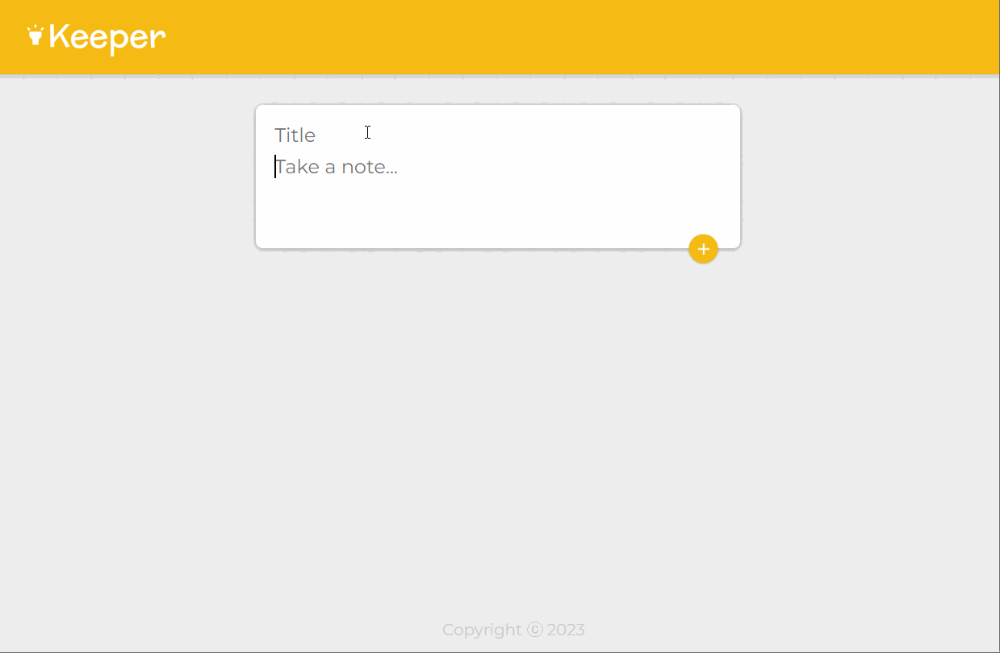

# Keeper App

- A web app clone to Google Keep which allows users to create and delete notes.
- The application features a clean and intuitive user interface, similar to the original app, with a minimalistic design and easy-to-use functionality.
- <a href="https://akshit1903.github.io/keeper/">Deployed Link</a>
- <a href="https://youtu.be/Iw2_gHcnWcg">YouTube</a>



## Features

- Note Creation: Users can create new notes with titles and content.
- Note Management: Easily delete notes.
- Responsive Design: The app is optimized for different screen sizes and devices.

## Installation

1. Clone the repository:

```bash
    git clone https://github.com/Akshit1903/keeper
```

2. Install the dependencies:

```bash
    cd keeper
    npm install
```

3. Start the application:

```bash
    npm start
```

4. Open your web browser and visit `http://localhost:3000` to access the Keeper app.

## Usage

- Launch the Keeper app in your web browser.
- Create a new note by clicking the input field.
- Enter a title and content for the note.
- Save the note by clicking the "+" button.
- Delete notes by using the trash buttons.
- Enjoy organizing and managing your notes seamlessly with Keeper!

## Technologies Used

- React.js: A JavaScript library for building user interfaces.
- HTML: Markup language for creating the app's structure.
- CSS: Stylesheets for enhancing the app's appearance.
